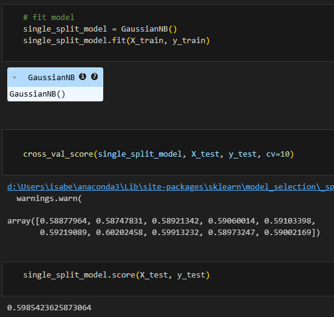
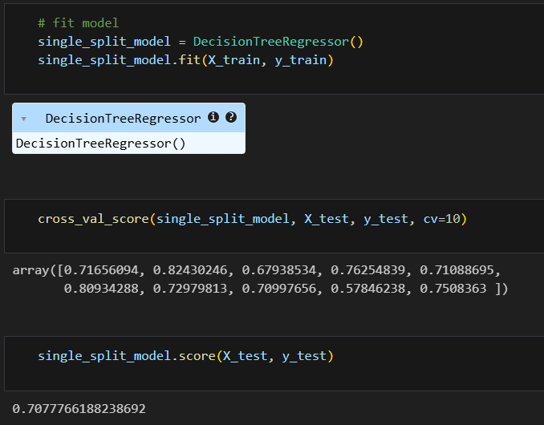
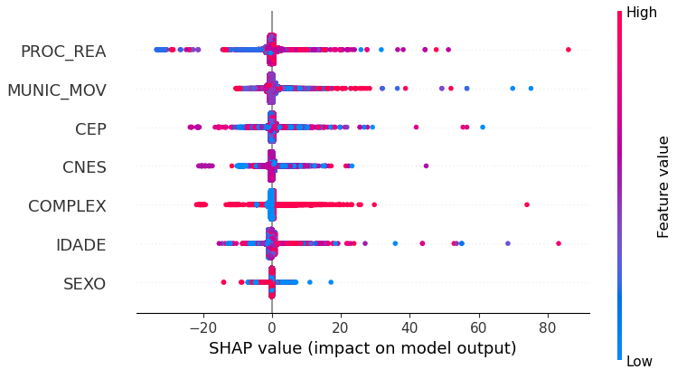
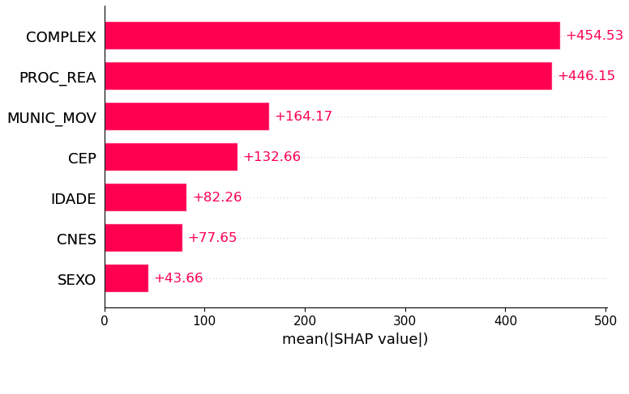
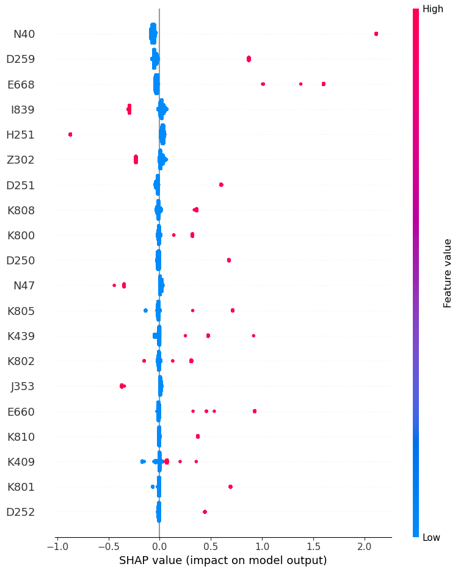
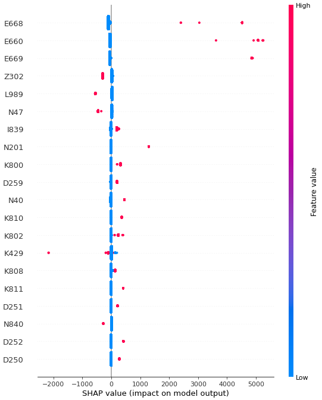

# Dados Medicos

Neste projeto, uma base de dados do Ministério da Saúde será analisada para realizar uma avaliação de quais variáveis relatadas no prontuário de cirurgias eletivas mais contribuem para a permanência do paciente no hospital, a possibilidade de morte deste e o valor utilizado para custear a cirurgia.

# Autores
1. Isabel Caroline Gomes Giannecchini
2. Maria do Socorro
3. Arthur Vanderline

# Tratamento

Nesta etapa, foi realizado o tratamento dos dados para selecionar as variáveis mais relevantes para a análise. A primeira remoção de variáveis foram aquelas que, de acordo com o dicionário de dados disponibilizado pelo Ministério estavam vazias ou desatualizadas, são estas:

- UTI_MES_IN
- UTI_MES_AN
- UTI_MES_AL
- UTI_INT_IN
- UTI_INT_AN
- UTI_INT_AL
- VAL_SADT
- VAL_RN
- VAL_ACOMP
- VAL_ORTP
- VAL_SANGUE
- VAL_SADTSR
- VAL_TRANSP
- VAL_OBSANG
- VAL_PED1AC
- DIAG_SECUN
- NATUREZA
- RUBRICA
- NUM_PROC
- TOT_PT_SP
- CPF_AUT

Com a remoção destas variáveis, foram analisadas as variáveis com valor igual em todos os registros, uma vez que essa informação constitui um filtro e não acrescenta valor à análise. Dessa forma, as colunas removidas sob esse critério foram:

|Nome da Coluna|Descrição|Preenchimento|Nota|
|--------------|---------|-------------|----|
| ANO_CMPT | Ano de processamento | todos 2015 | porque a base de dados disponibilizada é a de dados processados em 2015 |
| IDENT | Identificação do tipo da AIH | todos 1 ||
| CAR_INT | Caráter da internação | todos vazios | |
| SEQ_AIH5 | Sequencial de longa permanência | todos vazios | |
| GESTOR_DT | Data de autorização do gestor | todos vazios | |
| INFEHOSP | Status de infecção hospitalar | todos 0 | |
| CID_ASSO | CID Causa | todos vazios | dados pessoais |
| CID_MORTE | CID Morte | todos vazios | dados pessoais |
| AUD_JUST | Justificativa do gestor para aceitação | todos vazios | |
| SIS_JUST | Justificativa do estabelecimento para aceitação | todos vazios | |
| DIAGSEC5 | Diagnóstico secundário 5 | todos vazios | |
| DIAGSEC6 | Diagnóstico secundário 6 | todos vazios | |
| DIAGSEC7 | Diagnóstico secundário 7 | todos vazios | |
| DIAGSEC8 | Diagnóstico secundário 8 | todos vazios | |
| DIAGSEC9 | Diagnóstico secundário 9 | todos vazios | |
| TPDISEC5 | Tipo de diagnóstico secundário 5 | todos 0 | |
| TPDISEC6 | Tipo de diagnóstico secundário 6 | todos 0 | |
| TPDISEC7 | Tipo de diagnóstico secundário 7 | todos 0 | |
| TPDISEC8 | Tipo de diagnóstico secundário 8 | todos 0 | |
| TPDISEC9 | Tipo de diagnóstico secundário 9 | todos 0 | |

Por fim, foram removidas as colunas de identificação do prontuário e colunas redundantes, pois não agregam valor à análise e aumentam a dimensionalidade dos dados. Essas colunas, entretanto, são úteis para uma identificação e validação a posterior dos resultados. As colunas removidas neste critério são:

|Nome da Coluna|Descrição|
|--------------|---------|
| N_AIH | Número da AIH |
| REMESSA | Número da remessa do prontuário |
| ANO_CMPT | Ano de processamento da AIH, no formato aaaa |
| MÊS_CMPT | Mês de processamento da AIH, no formato mm |
| ESPEC | Especialidade do Leito |
| CGC_HOSP | CNPJ do Estabelecimento |
| MUNIC_RES | Município de Residência do Paciente |
| NASC | Data de nascimento do paciente (aaaammdd) |
| SEXO | Sexo do paciente |
| UTI_MES_TO | Quantidade de dias de UTI no mês |
| MARCA_UTI | Indica qual o tipo de UTI utilizada pelo paciente |
| UTI_INT_TO | Quantidade de diárias em unidade intermediaria
| DIAR_ACOM | Quantidade de diárias de acompanhante |
| PROC_SOLIC | Procedimento solicitado |
| VAL_SH | Valor de serviços hospitalares |
| VAL_SP | Valor de serviços profissionais |
| VAL_UTI | Valor de UTI |
| US_TOT | Valor total, em dólar |
| DI_INTER | Data de internação no formato aaammdd |
| DT_SAIDA | Data de saída, no formato aaaammdd |
| COBRANCA | Motivo de Saída/Permanência |
| NAT_JUR | Natureza jurídica do Estabelecimento, conforme a Comissão Nacional de Classificação - CONCLA |
| GESTAO | Indica o tipo de gestão do hospital |
| IND_VDRL | Indica exame VDRL |
| DIAS_PERM | Dias de Permanência |
| NACIONAL | Código da nacionalidade do paciente |
| CAR_INT | Caráter da internação |
| HOMONIMO | Indicador se o paciente da AIH é homônimo do paciente de outra AIH |
| NUM_FILHOS | Número de filhos do paciente |
| INSTRU | Grau de instrução do paciente |
| CID_NOTIF | CID de Notificação |
| CONTRACEP1 | Tipo de contraceptivo utilizado |
| CONTRACEP2 | Segundo tipo de contraceptivo utilizado |
| GESTRISCO | Indicador se é gestante de risco |
| INSC_PN | Número da gestante no pré-natal |
| SEQ_AIH5 | Sequencial de longa permanência (AIH tipo 5) |
| CBOR | Ocupação do paciente, segundo a Classificação Brasileira de Ocupações – CBO |
| CNAER | Código de acidente de trabalho |
| VINCPREV | Vínculo com a Previdência |
| GESTOR_COD | Motivo de autorização da AIH pelo Gestor |
| GESTOR_TP | Tipo de gestor |
| GESTOR_CPF | Número do CPF do Gestor |
| GESTOR_DT | Data da autorização dada pelo Gestor (aaaammdd) |
| CNPJ_MANT | CNPJ da mantenedora |
| INFEHOSP | Status de infecção hospitalar |
| CID_ASSO | CID causa |
| CID_MORTE | CID da morte |
| FINANC | Tipo de financiamento |
| FAEC_TP | Subtipo de financiamento FAEC |
| REGCT | Regra contratual |
| RACA_COR | Raça/Cor do paciente |
| ETNIA | Etnia do paciente, se raça cor for indígena |
| SEQUENCIA | Sequencial da AIH na remessa |
| REMESSA | Número da remessa |
| AUD_JUST | Justificativa do auditor para aceitação da AIH sem o número do Cartão Nacional de Saúde |
| SIS_JUST | Justificativa do estabelecimento para aceitação da AIH sem o número do Cartão Nacional de Saúde |
| VAL_SH_FED | Valor do complemento federal de serviços hospitalares |
| VAL_SP_FED | Valor do complemento federal de serviços profissionais |
| VAL_SH_GES | Valor do complemento do gestor (estadual ou municipal) de serviços hospitalares | 
| VAL_SP_GES | Valor do complemento do gestor (estadual ou municipal) de serviços profissionais | 
| VAL_UCI | Valor de UCI |
| MARCA_UCI | Tipo de UCI utilizada pelo paciente |

As colunas mantidas e selecionadas para a avaliação foram:

|Nome da Coluna|Descrição|
|--------------|---------|
| MUNIC_MOV | Município do Estabelecimento |
| CEP | CEP do paciente |
| CNES | Código CNES do hospital |
| PROC_REA | Procedimento realizado |
| SEXO | Sexo do paciente |
| QT_DIARIAS | Quantidade de diárias |
| VAL_TOT | Valor total da AIH |
| DIAG_PRINC | Código do diagnóstico principal (CID10) |
| COD_IDADE | Unidade de medida da idade |
| IDADE | Idade |
| MORTE | Indica Óbito |
| COMPLEX | Complexidade |
| DIAGSEC1 | Diagnóstico secundário1 |
| DIAGSEC2 | Diagnóstico secundário 2 |
| DIAGSEC3 | Diagnóstico secundário 3 |
| DIAGSEC4 | Diagnóstico secundário 4 |

# Avaliação dos problemas

Para cada problema, os diagnósticos foram avaliados separadamente das demais variáveis preditoras. Isso porque, por se tratar de uma variável em texto, houve a necessidade de realizar um procedimento adicional para possibilitar a avaliação da importância de cada diagnóstico na previsão da quantidade de diárias que um paciente permaneceu no hospital, na ocorrência ou não de morte e na previsão de orçamento para o tratamento desse paciente. Esse procedimento e a análise realizada quanto à importância de cada diagnóstico serão apresentados na sessão [Diagnóstico](#diagnóstico)

## Quantidade de dias de internação

O problema da quantidade de dias do paciente em internação configura-se como uma tarefa de classificação em múltiplas classes. Isso se dá porque o valor, em dias, adotado pelo Ministério da Saúde para o registro dessa variável não é contínuo, mas sim uma variável categórica que representa a quantidade de dias de permanência de um paciente no hospital (arredondada para cima), de forma que, se um paciente permanece 3 dias e 5 horas no hospital, o prontuário registrará 4 dias.

Dessa forma, foram analisados modelos de classificação para a apreciação do problema e, com base nos resultados de acurácia e precisão encontrados, o modelo com a melhor performance foi o Naive Bayes, modelo de classificação baseado no método bayesiano de probabilidade e estatística, com uma acurácia próxima a 60% no acerto da quantidade de dias de internação de um paciente no hospital com base nas variáveis avaliadas [Figura 1](#Figura_1).

[Figura_1]: imagens/GNB.png "Acurácia do método Gaussian Naive Bayes para o problema de quantidade de dias de internação" 

## Óbito

O problema da previsão de óbito trata-se de uma classificação binária, uma vez que um paciente pode ou não ir a óbito em decorrência de um procedimento cirurgico.

Para a avaliação deste problema também foi utilizado o método Naive Bayes de classificação com uma acurácia de 99,8% [Figura 2](#Figura_2).

[Figura_2]: imagens/GNB_obito.png "Acurácia do método Gaussian Naive Bayes para o problema de óbito" 

Esse resultado, entretanto, não é mérito do modelo e sim da baixa ocorrência de óbitos em cirurgias eletivas registrada na base de dados disponibilizada. Com uma prevalência de 0,12% de registros com óbito, o modelo não contou com dados balanceados para a realização da análise. Não foram utilizadas técnicas para realizar o balanceamento da amostra por se tratarem de dados médicos, como estes dados são registros objetivos de procedimentos eletivos realizados, a implementação de qualquer técnica de balanceamento contribuiria para a inserção de viéses na amostra prejudicando o modelo ainda que entregando uma melhor eficácia numérica para sua previsão. Dadas essas avaliações, o problema de óbitos não foi apreciado nas demais partes desta avaliação, entretanto, foi realizada uma análise exploratória nos registros de pacientes em óbito.

### Análise exploratória dos registros de pacientes em óbito

Em relação aos registros de óbito, os pacientes nesta condição permaneceram em média 8 dias internados, sendo qua a quantidade máxima de dias de internação antes de ir a óbito foi 275 dias. Nesta ocorrência, a paciente era uma mulher de 65 anos, diagnosticada com obesidade, submetida ao procedimento de "GASTRECTOMIA VERTICAL EM MANGA (SLEEVE)", cirurgia bariátrica do tipo Sleeve. O procedimento representou um custo de R$11676,40. 

Entre os registros de óbito, o diagnóstico mais comum foi o de pedra na vesícula e suas variações, com 38 ocorrências, representando uma prevalência de 13% em cirurgias eletivas. Por fim, o procedimento realizado com maior prevalência de óbitos foi a "LAPAROTOMIA EXPLORADORA". 

Tratando-se da idade, a média entre os pacientes que foram a óbito é de 58 anos, indicando um maior risco de falecimento na realização de cirurgias em pessoas com idade mais avançada. Entre os pacientes que foram a óbito com menos de 58 anos, o diagnóstico com maior prevalência foi dor abdominal, com 16 ocorrências, e o procedimento com maior prevalência de óbitos foi a "LAPAROTOMIA EXPLORADORA", da mesma forma que no caso geral de pacientes que evoluíram a óbito.

## Valor total da operação e internação

Já o problema do valor, em reais, utilizado para custear a internação e operação do paciente configura-se como um problema de regressão, uma vez que a variável resposta é um valor numérico contínuo. Para este caso, o modelo escolhido para a análise foi a Árvore de Decisão, em virtude da natureza das variáveis preditoras disponíveis na base de dados analisada, apresentando um coeficiente de determinação de 70% [Figura 3](#Figura_3).

[Figura_3]: imagens/DT_val.png "Coeficiente de determinação para o problema de previsão do valor utilizado para custeio do procedimento e internação do paciente" 
.

# Avaliação das variáveis preditoras

Mais importante do que avaliar a acurácia de um modelo na previsão de uma variável é identificar como as variáveis utilizadas por esse modelo influenciam o resultado gerado. Para isso, foi utilizado um método de avaliação de importância derivado da teoria dos jogos, denominado _SHapley Additive exPlanations_ (SHAP). Este método decompõe a previsão de um modelo nas contribuições de cada variável e, com isso, permite uma interpretabilidade global e local da importância de cada variável e como ela influencia previsões individuais.

## Quantidade de dias de internação

Para a quantidade de dias de internação, as variáveis mais importantes para a construção deste resultado estão dispostas na [Figura 4](#Figura_4).

[Figura_4]: imagens/importancia_geral_dias.png "Importância geral para previsão da quantidade de dias de internação" 

Este diagrama mostra que as variáveis com mais impacto na permanência de um paciente no hospital são, em ordem de importância, o procedimento realizado, a localidade do hospital onde a cirurgia foi realizada e o local de residência do paciente. Em seguida, com menor impacto, destacam-se o código de registro do hospital, a complexidade do procedimento realizado, a idade e o sexo do paciente.  

O comportamento das importâncias individuais pode ser avaliado na [Figura 5](#Figura_5).

[Figura_5]: imagens/importancia_individual_dias.png "Importância individual para previsão da quantidade de dias de internação" 

Esse diagrama permite a visualização da manifestação de importância no espectro de valores de cada variável. Como exemplo, de acordo com o diagrama, valores mais baixos de complexidade tiveram impacto negativo na quantidade de dias de permanência do paciente no hospital, enquanto valores mais elevados de complexidade impactaram tanto positivamente quanto negativamente essa variável. A partir dessa análise, é possível perceber que pacientes do sexo masculino (01) permaneceram no hospital mais dias do que pacientes do sexo feminino (03), haja vista que, de acordo com o diagrama, para a variável sexo, valores menores tiveram um impacto mais positivo na quantidade de diárias do paciente no hospital. De modo semelhante, idades mais elevadas tiveram importâncias maiores na quantidade de dias do paciente no hospital, enquanto idades mais baixas apresentaram impacto negativo na permanência do paciente no hospital. 

Em relação ao procedimento realizado, à localização do hospital, ao local de moradia do paciente e ao código do hospital, a relação demonstrada por este diagrama não pode ser analisada diretamente em termos de quantidade. Isso ocorre porque, apesar de serem expressas em valores numéricos, essa variáveis são identificadoras e não representam uma relação de precedência entre seus valores. Assim, é possível indicar que estas variáveis contribuem, de forma geral, para a quantidade de diárias de um paciente no hospital [(Figura 4)](#Figura_4), entretanto, a relação entre cada valor destas variáveis não é suficiente para representar sua importância na quantidade de diárias.

## Valor total da operação e internação

Para o valor investido no paciente, a relação de importância das variáveis na previsão do valor está disposta na [Figura 6](#Figura_6).

[Figura_6]: imagens/importancia_geral_valor.png "Importância geral para previsão do valor investido no paciente" 

De acordo com este diagrama, a complexidade da operação e o procedimento realizado têm uma importância, em média, quatro vezes maior que as demais variáveis para a previsão do valor investido no paciente, indicando que complexidades maiores podem representar custos maiores para operações, enquanto complexidades menores representam custos menos elevados. Em relação aos procedimentos, pode existir uma série de procedimentos que representam custos mais elevados para o Sistema Único de Saúde do que outros. 

A localidade do paciente e do hospital também representam importâncias relevantes na previsão do valor investido no paciente, entretanto, essa importância pode ser explicada por questões econômicas locais, em detrimento de fatores médicos. Um custo mais elevado de uma operação em determinado local pode estar mais relacionado à logística necessária para a entrega de materiais necessários para a sua realização e ao valor salarial da equipe nessas localidades. 

Já idade e sexo do paciente representam importâncias menores para a previsão do investimento necessário ao tratamento, juntamente com a categoria do hospital.

## Diagnóstico

Em relação aos diagnósticos, como apresentado na seção [Avaliação dos problemas](#avaliação-dos-problemas), estes foram analisados separadamente das demais variáveis para verificar sua importância na previsão da quantidade de dias de permanência no hospital e no valor total investido no paciente. Essa separação ocorreu em virtude das características da variável diagnóstico, além de serem variáveis textuais, o que demanda um processo de tokenização para sua interpretação pelo modelo de previsão utilizado. Além disso, os diagnósticos apresentam diversas ramificações, o que gera maior dispersão nos dados e reduz a importância relativa de cada ocorrência individual quando comparada às demais variáveis. Dessa forma, em termos relativos, os diagnósticos não apresentaram relevância para a análise.

Para a avaliação, primeiramente foram unificados os diagnósticos em cada classificação (principal e secundários). Entretanto, o resultado encontrado refletiu  mais as situações causadoras do que os diagnósticos em si [Figura 7](#Figura_7).

[Figura_7]: imagens/shap_diagnosticos.png "Situações com maior importância para a quantidade de dias de internação do paciente" 

| CID10 | Descrição                      | 
| -------------- | ------------------------------ |
| W019 |  Queda no mesmo nível por escorregão, tropeção ou passos em falsos em local não especificado |
| Y831 |  Reação anormal em paciente ou complicação tardia, causadas por intervenção cirúrgica com implante de uma prótese interna, sem menção de acidente durante a intervenção |
| V091 |  Pedestre traumatizado em um acidente não-de-trânsito não especificado |
| W038 |  quedas no mesmo nível causadas por colisões ou empurrões de terceiros, em locais específicos não listados de forma detalhada |

Dentro dessa análise, foram encontradas situações extremas e específicas que não permitiam a generalização dos resultados, como, por exemplo, o diagnóstico de fratura no quadril, em que o paciente permaneceu no hospital por 67 dias, dez vezes mais do que a média de diárias de internação geral da base de dados disponível. Por esse motivo, a análise dos diagnósticos foi restrita ao caso dos diagnósticos principais, que não incluem as situações que geraram os diagnósticos do paciente.

### Quantidade de dias de internação

Os diagnósticos mais relevantes para a previsão de dias de internação de um paciente estão dispostos na [Figura 8](#Figura_8).

[Figura_8]: imagens/importancia_individual_diagnostico_dias.png "Diagnósticos com maior importância para a quantidade de dias de internação do paciente" 

Neste diagrama é possível identificar valores relacionados na cor vermelha como a presença de determinado diagnóstico e valores identificados como azul como a ausência de determinado diagnóstico. Neste caso, o diagnóstico com maior impacto para a quantidade de dias de internação é o diagnóstico N40 (Hiperplasia da próstata), com uma média de permanência de 4 dias e uma ocorrência com 127 dias. Esse mesmo padrão aconteceu para a maior parte dos diagnósticos descritos na [Figura 8](#Figura_8), na qual um registro "puxa" o valor de importância de um diagnóstico sem a devida generalização da análise. Apesar disso, a redução da amostra de diagnósticos avaliados (de 70% para 40%) diminuiu muito a acurácia do modelo. Dessa forma, para evitar a prevalencia de casos individuais na explicação dos preditores do modelo, haverá uma preferência para a análise do diagrama de importâncias individuais em detrimento do diagrama de importância geral nesta análise.

| CID10 | Quantidade média de diárias de internação| Nota |
| ----- | ---------------------------------------- | ---- |
|  N40  | 4 diárias em média  | uma ocorrência de 127 dias puxando a importância do diagnóstico para cima |
|  D259  | 3 diárias em média  |   |
|  E668  | 3 diárias em média  | uma ocorrência de 275 dias puxando a importância do diagnóstico para cima |
|  I839  | 1 diária em média  | uma ocorrência de 152 dias puxando a importância do diagnóstico para cima |
|  H251  | 1 diária em média  |   |
|  Z302  | 1 diária em média  | uma ocorrência de 304 dias puxando a importância do diagnóstico para cima |

Os diagnósticos com maior importância para a definição da quantidade de diárias de internação são a hiperplasia da próstata (N40) e Câncer no útero (D259), ambos relacionados a casos oncológicos que demandam maiores cuidados e atenção médica e, portanto, podem estar associados a um maior número de diárias de internação hospitalar. Adicionalmente, casos de obesidade (E668) também se relacionam a uma maior quantidade de diárias de internação, sendo que o caso destacado para o diagnóstico E668 é o mesmo destacado na sessão [Óbito](#óbito).

Já casos como varizes (I839), cataráta (H251) e esterilização (Z302) estão associados a uma menor quantidade de diárias de internação hospitalar.

Outros destaques na [Figura 8](#Figura_8) são os casos de hipertrofia do prepúscio (N47), com média de um dia de internação; hipertrofia das amígdalas (J353), com média de um dia e quantidade máxima de 32 diárias; e outras variantes da obesidade (E660), com média de 3 diárias de internação e quantidade máxima de 90 dias.

Apesar dos baixos valores absolutos de dias de internação, a média global de quantidade de diárias hospitalares nesta base de dados é de 7 dias. Assim, valores como 3 ou 4 dias de internação representam entre 40 e 60% da média dessa média.

Em 2015, a pessoa que permaneceu a maior quantidade de dias no hospital apresentou diagnóstico de aborto espontâneo retido (O021), permanecendo internada por 337 dias. Já o menor número de diárias de internação hospitalar (0) ocorreu em casos de cataráta (H521), conforme evidenciado na [Figura 8](#Figura_8).

### Valor total da operação e internação

Da mesma forma que na análise da quantidade de dias de internação, a utilização dos 10 diagnósticos mais comuns (40% da amostra) para prever o valor total investido no paciente comprometeu o desempenho do modelo em relação à utilização dos 50 diagnósticos mais comuns (70% da amostra). Por esse motivo, para a previsão do valor total, foram utilizados os 50 diagnósticos mais comuns.

Para os casos de diagnósticos com a maior representação de despesas, diferentemente das análises anteriores, não foram observados casos isolados com importância elevada, mas sim uma maior concentração desses resultados na composição do valor total resultante [Figura 9](#Figura_9).

[Figura_9]: imagens/importancia_individual_diagnostico_valor.png "Diagnósticos mais comuns com maior importância para o valor total investido no paciente" 

O diagnóstico com o tratamento mais caro é a obesidade e suas variantes (E668, E660 e E669). Já o tratamento para esterelização (Z302), problemas de pele (L989) e hipertrofia do prepúscio (N47) estão entre os diagnósticos com maior importância para a redução dos valores investidos no paciente, isto é, condições com tratamentos de menor custo. Esses diagnósticos apresentam a seguinte média de valores investidos:

| CID10 | Média de valor total | 
| ----- | -------------------- |
| E668  | R$5358,86 |
| E660  | R$5996,72 |
| E669  | R$4883,53 |
| Z302  | R$425,97 |
| L989  | R$311,44 |
| N47   | R$275,09 |

A média global do valor total de internação é de R$1582,49, de forma que o valor médio despendido com casos de obesidade representa de 3 a 4 vezes o valor médio utilizado para custear cirurgias eletivas, enquanto o valor máximo investido no diagnóstico de esterelização foi menos de duas vezes maior que a média global.

O diagnóstico com tratamento de maior valor investido pelo SUS no ano de 2015 foi de insuficiência hepática, no montante de R$99868,59. Já nos casos de tratamentos mais baratos, o diagnótico não exerceu grande influência no valor do procedimento. O procedimento de menor custo realizado em 2015 foi a retirada de catéter, com valor total de R$20,74.

# Conclusão

Os dados analisados, por se tratarem de dados médicos, apresentam alta variabilidade e imprevisibilidade. Em relação à quantidade de diárias que uma pessoa tende a permanecer no hospital e ao valor utilizado para custear o procedimento realizado e as diárias, observa-se que esses indicadores são influenciados por variáveis distintas. Enquanto o procedimento realizado é relevante para ambas as análises, a complexidade do procedimento tem uma importância cerca de 400 vezes maior para a explicação dos valores utilizados do que para a quantidade de diárias. Por outro lado, o município de residênia do paciente possui maior relevância, em termos relativos, para a previsão da quantidade de diárias do que para a previsão do valor investido no tratamento do paciente.

Essas relações podem ser explicadas pela distância entre o município e o hospital, bem como pelas possibilidades de transporte disponíveis, que podem gerar a necessidade mais diárias hospitalares para determinados municípios em comparação a outros. Além disso, a complexidade do procedimento está relacionada aos custos para sua realização, ao passo que procedimentos com diferentes complexidades podem demandar tempos de recuperação semelhantes, resultando em quantidades próximas de dias de internação.

Em relação ao diagnóstico, pacientes com o mesmo diagnóstico podem ser submetidos a procedimentos distintos. Por exemplo, a remoção de catéter, o procedimento de menor custo realizado em 2015, foi realizada em pacientes com diferentes diagnósticos. Entretanto, a depender do diagnóstico, pode haver a necessidade de procedimentos mais específicos, o que justifica a avaliação do diagnóstico como variável preditora tanto para o valor total quanto a para quantidade de diárias.

No que diz respeito ao óbito, como não havia um quantitativo suficiente de registros para uma análise preditiva, optou-se por realizar uma análise exploratória. Essa análise demonstrou que, assim como nas demais análises, a obesidade é um diagnóstico associado ao óbito de pacientes submetidos a procedimentos eletivos no Sistema Único de Saúde. 

Dentre os resultados encontrados, destaca-se que a obesidade, além de ser um diagnóstico complexo que demanda recuperação mais longa e maior investimento público para o tratamento, também representa um fator de risco para a vida dos pacientes, configurando-se como o principal destaque desta avaliação.

Para futuros estudos, recomenda-se avaliar as causas do diagnóstico de obesidade e buscar explicações mais abrangentes sobre os dispêndios do Sistema Único de Saúde relacionados a esse diagnóstico. Além disso, é relevante identificar com maior incidência de procedimentos relacionados à obesidade, de forma a orientar medidas de prevenção voltadas a essas populações, visando reduzir a necessidade de tratamentos e os gastos associados a esse diagnóstico.
