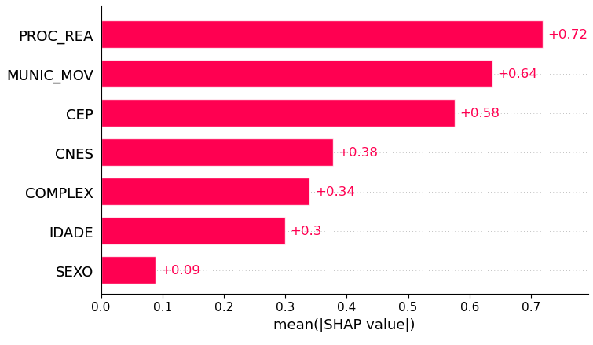

# Dados Medicos

Neste projeto, uma base de dados do ministério da saúde será analisada para realizar uma avaliação de quais variáveis relatadas no prontuário de cirurgias eletivas mais contribuem para a permanência do paciente no hospital, a possibilidade de morte deste e o valor utilizado para custear a cirurgia.

# Tratamento

Nesta análise, primeiro foi realizado um tratamento dos dados para a escolha das variáveis mais relevantes para a análise. A primeira remoção de variáveis foram aquelas que, de acordo com o dicionário de dados disponibilizado pelo ministério estavam vazias ou desatualizadas, são estas:

- UTI_MES_IN
- UTI_MES_AN
- UTI_MES_AL
- UTI_INT_IN
- UTI_INT_AN
- UTI_INT_AL
- VAL_SADT
- VAL_RN
- VAL_ACOMP
- VAL_ORTP
- VAL_SANGUE
- VAL_SADTSR
- VAL_TRANSP
- VAL_OBSANG
- VAL_PED1AC
- DIAG_SECUN
- NATUREZA
- RUBRICA
- NUM_PROC
- TOT_PT_SP
- CPF_AUT

Com a remoção destas variáveis, foram analisadas as variáveis com valor igual em todos os registros, uma vez que essa informação se trataria de um filtro e não uma informação que acrescenta valor à análise. Dessa forma, as colunas removidas sob esse critério foram:

|Nome da Coluna|Descrição|Preenchimento|Nota|
|--------------|---------|-------------|----|
| ANO_CMPT | Ano de processamento | todos 2015 | porque a base de dados disponibilizada é a de dados processados em 2015 |
| IDENT | Identificação do tipo da AIH | todos 1 ||
| CAR_INT | Caráter da internação | todos vazios | |
| SEQ_AIH5 | Sequencial de longa permanência | todos vazios | |
| GESTOR_DT | Data de autorização do gestor | todos vazios | |
| INFEHOSP | Status de infecção hospitalar | todos 0 | |
| CID_ASSO | CID Causa | todos vazios | dados pessoais |
| CID_MORTE | CID Morte | todos vazios | dados pessoais |
| AUD_JUST | Justificativa do gestor para aceitação | todos vazios | |
| SIS_JUST | Justificativa do estabelecimento para aceitação | todos vazios | |
| DIAGSEC5 | Diagnóstico secundário 5 | todos vazios | |
| DIAGSEC6 | Diagnóstico secundário 6 | todos vazios | |
| DIAGSEC7 | Diagnóstico secundário 7 | todos vazios | |
| DIAGSEC8 | Diagnóstico secundário 8 | todos vazios | |
| DIAGSEC9 | Diagnóstico secundário 9 | todos vazios | |
| TPDISEC5 | Tipo de diagnóstico secundário 5 | todos 0 | |
| TPDISEC6 | Tipo de diagnóstico secundário 6 | todos 0 | |
| TPDISEC7 | Tipo de diagnóstico secundário 7 | todos 0 | |
| TPDISEC8 | Tipo de diagnóstico secundário 8 | todos 0 | |
| TPDISEC9 | Tipo de diagnóstico secundário 9 | todos 0 | |

Por fim, foram removidas as colunas de identificação do prontuário e colunas redundantes porque estas trazem informações que não contribuem para a análise e aumentam a dimensionalidade dos dados analisados, essas colunas são, entretanto, úteis para uma identificação e validação a posteriori dos resultados. As colunas removidas neste critério são:

|Nome da Coluna|Descrição|
|--------------|---------|
| N_AIH | Número da AIH |
| REMESSA | Número da remessa do prontuário |
| ANO_CMPT | Ano de processamento da AIH, no formato aaaa |
| MÊS_CMPT | Mês de processamento da AIH, no formato mm |
| ESPEC | Especialidade do Leito |
| CGC_HOSP | CNPJ do Estabelecimento |
| MUNIC_RES | Município de Residência do Paciente |
| NASC | Data de nascimento do paciente (aaaammdd) |
| SEXO | Sexo do paciente |
| UTI_MES_TO | Quantidade de dias de UTI no mês |
| MARCA_UTI | Indica qual o tipo de UTI utilizada pelo paciente |
| UTI_INT_TO | Quantidade de diárias em unidade intermediaria
| DIAR_ACOM | Quantidade de diárias de acompanhante |
| PROC_SOLIC | Procedimento solicitado |
| VAL_SH | Valor de serviços hospitalares |
| VAL_SP | Valor de serviços profissionais |
| VAL_UTI | Valor de UTI |
| US_TOT | Valor total, em dólar |
| DI_INTER | Data de internação no formato aaammdd |
| DT_SAIDA | Data de saída, no formato aaaammdd |
| COBRANCA | Motivo de Saída/Permanência |
| NAT_JUR | Natureza jurídica do Estabelecimento, conforme a Comissão Nacional de Classificação - CONCLA |
| GESTAO | Indica o tipo de gestão do hospital |
| IND_VDRL | Indica exame VDRL |
| DIAS_PERM | Dias de Permanência |
| NACIONAL | Código da nacionalidade do paciente |
| CAR_INT | Caráter da internação |
| HOMONIMO | Indicador se o paciente da AIH é homônimo do paciente de outra AIH |
| NUM_FILHOS | Número de filhos do paciente |
| INSTRU | Grau de instrução do paciente |
| CID_NOTIF | CID de Notificação |
| CONTRACEP1 | Tipo de contraceptivo utilizado |
| CONTRACEP2 | Segundo tipo de contraceptivo utilizado |
| GESTRISCO | Indicador se é gestante de risco |
| INSC_PN | Número da gestante no pré-natal |
| SEQ_AIH5 | Sequencial de longa permanência (AIH tipo 5) |
| CBOR | Ocupação do paciente, segundo a Classificação Brasileira de Ocupações – CBO |
| CNAER | Código de acidente de trabalho |
| VINCPREV | Vínculo com a Previdência |
| GESTOR_COD | Motivo de autorização da AIH pelo Gestor |
| GESTOR_TP | Tipo de gestor |
| GESTOR_CPF | Número do CPF do Gestor |
| GESTOR_DT | Data da autorização dada pelo Gestor (aaaammdd) |
| CNPJ_MANT | CNPJ da mantenedora |
| INFEHOSP | Status de infecção hospitalar |
| CID_ASSO | CID causa |
| CID_MORTE | CID da morte |
| FINANC | Tipo de financiamento |
| FAEC_TP | Subtipo de financiamento FAEC |
| REGCT | Regra contratual |
| RACA_COR | Raça/Cor do paciente |
| ETNIA | Etnia do paciente, se raça cor for indígena |
| SEQUENCIA | Sequencial da AIH na remessa |
| REMESSA | Número da remessa |
| AUD_JUST | Justificativa do auditor para aceitação da AIH sem o número do Cartão Nacional de Saúde |
| SIS_JUST | Justificativa do estabelecimento para aceitação da AIH sem o número do Cartão Nacional de Saúde |
| VAL_SH_FED | Valor do complemento federal de serviços hospitalares |
| VAL_SP_FED | Valor do complemento federal de serviços profissionais |
| VAL_SH_GES | Valor do complemento do gestor (estadual ou municipal) de serviços hospitalares | 
| VAL_SP_GES | Valor do complemento do gestor (estadual ou municipal) de serviços profissionais | 
| VAL_UCI | Valor de UCI |
| MARCA_UCI | Tipo de UCI utilizada pelo paciente |

As colunas mantidas e selecionadas para a avaliação foram:

|Nome da Coluna|Descrição|
|--------------|---------|
| MUNIC_MOV | Município do Estabelecimento |
| CEP | CEP do paciente |
| CNES | Código CNES do hospital |
| PROC_REA | Procedimento realizado |
| SEXO | Sexo do paciente |
| QT_DIARIAS | Quantidade de diárias |
| VAL_TOT | Valor total da AIH |
| DIAG_PRINC | Código do diagnóstico principal (CID10) |
| COD_IDADE | Unidade de medida da idade |
| IDADE | Idade |
| MORTE | Indica Óbito |
| COMPLEX | Complexidade |
| DIAGSEC1 | Diagnóstico secundário1 |
| DIAGSEC2 | Diagnóstico secundário 2 |
| DIAGSEC3 | Diagnóstico secundário 3 |
| DIAGSEC4 | Diagnóstico secundário 4 |

# Avaliação dos problemas

Para cada problema os diagnósticos foram avaliados em separado das demais variáveis preditoras. Isso porque, por se tratar de uma variável em texto, houve a necessidade de realizar um procedimento adicional para ser possível a avaliação da importância de cada diagnóstico na previsão da quantidade de diárias que um paciente permaneceu no hospital, na ocorrência ou não de morte e na previsão de orçamento para o tratamento deste paciente, esse procedimento e a análise realizada quanto à importância de cada diagnóstico será apreciada na sessão 
[Diagnóstico](#diagnóstico)

## Quantidade de dias de internação

O problema da quantidade de dias do paciente em internação trata-se de um problema de classificação em múltiplas classes. Isso se dá porque, o valor, em dias, adotado pelo ministério da saúde para registro dessa variável não é contínuo, e sim uma variável categórica que representa a quantidade de dias de permanência de um paciente no hospital (arredondada para cima), de forma que, se um paciente ficou 3 dias e 5 horas no hospital, no prontuário o registro será de 4 dias.

Dessa forma, foram analisados modelos de classificação para a apreciação do problema e, com base nos resultados de acurácia e precisão encontrados, o modelo com a melhor performance foi o Naive Bayes, modelo de classificação baseado no método bayesiano de probabilidade e estatística, com uma acurácia próxima a 60% no acerto da quantidade de dias de internação de um paciente no hospital com base nas variáveis avaliadas [Figura 1](#Figura_1).

[Figura_1]: imagens/GNB.png "Acurácia do método Gaussian Naive Bayes para o problema de quantidade de dias de internação" 

## Óbito

O problema da previsão de óbito trata-se de uma classificação binária, uma vez que um paciente pode ou não ir a óbito em decorrência de um procedimento cirurgico.

Para a avaliação deste problema também foi utilizado o método Naive Bayes de classificação com uma acurácia de 99,8% [Figura 2](#Figura_2).

[Figura_2]: imagens/GNB_obito.png "Acurácia do método Gaussian Naive Bayes para o problema de óbito" 

Esse resultado, entretanto, não é mérito do modelo e sim da baixa ocorrência de óbitos em cirurgias eletivas registrada na base de dados disponibilizada. Com uma prevalência de 0,12% de registros com óbito, o modelo não contou com dados balanceados para a realização desta análise. Não foram utilizadas técnicas para realizar o balanceamento da amostra por se tratarem de dados médicos, como estes dados são registros objetivos de procedimentos eletivos realizados, a implementação de qualquer técnica de balanceamento contribuiria para a inserção de viéses na amostra prejudicando o modelo ainda que entregando uma melhor eficácia numérica para sua previsão. Dadas essas avaliações, o problema de óbitos não foi apreciado nas demais partes desta avaliação, entretanto, foi realizada uma análise exploratória nos registros de pacientes em óbito.

### Análise exploratória dos registros de pacientes em óbito

Em relação aos registros de óbito, os pacientes nesta condição permaneceram uma média de 8 dias em internação e quantidade máxima de dias que um paciente ficou internado antes de ir a óbito foram 275 dias. Nesta ocorrência, a paciente era uma mulher de 65 anos, foi diagnosticado com obesidade e foi submetido ao procedimento de "GASTRECTOMIA VERTICAL EM MANGA (SLEEVE)", cirurgia bariátrica do tipo Sleeve, o procedimento representou o valor de R$11676,40. 

De todos os óbitos, o diagnóstico mais comum para o caso de óbitos é o diagnóstico de pedra na vesícula e suas variações com 38 ocorrências dentre os óbitos registrados, demonstrando uma prevalência de 13% nos registros de óbito em cirurgias eletivas, por fim, o procedimento realizado com maior prevalência de óbitos foi a "LAPAROTOMIA EXPLORADORA". 

Por fim, a idade média dos pacientes é de 58 anos, indicando um maior risco de falecimento na realização de cirurgias em pessoas com idade mais avançada. Dentre os pacientes que foram a óbito em idade menor que 58 anos, o diagnóstico com maior prevalência foi dor abdominal com 16 ocorrências neste grupo e o procedimento realizado com maior prevalência de óbitos foi a "LAPAROTOMIA EXPLORADORA" para este grupo, da mesma forma que no caso geral de pacientes em óbito.

## Valor total da operação e internação

Já o problema do valor, em reais, utilizado para custear a internação e operação do paciente é um problema de regressão, uma vez que a variável resposta é um valor numérico contínuo. Para este caso, o modelo escolhido para a apreciação foi a Árvore de Decisão em virtude da natureza das variáveis preditoras disponíveis na base de dados analisada, com um coeficiente de determinação de 70% [Figura 3](#Figura_3).

[Figura_3]: imagens/DT_val.png "Coeficiente de determinação para o problema de previsão do valor utilizado para custeio do procedimento e internação do paciente" 
.

# Avaliação das variáveis preditoras

Mais importante do que avaliar a acurácia de um modelo na previsão de uma variável é identificar como as variáveis utilizadas por esse modelo na previsão influenciam o resultado do modelo aplicado. Para isso, foi utilizado um método de avaliação de importância derivado da teoria dos jogos chamado _SHapley Additive exPlanations_ - SHAP. Este método decompõe a previsão de um modelo nas contribuições de cada variável e, com isso, permite uma interpretabilidade global e local da importância de uma variável para uma previsão e como ela influencia previsões individuais.

## Quantidade de dias de internação

Para a quantidade de dias de internação, as variáveis mais importantes para a construção deste resultado estão dispostas na [Figura 4](#Figura_4).

[Figura_4]: imagens/importancia_geral_dias.png "Importância geral para previsão da quantidade de dias de internação" 

Este diagrama mostra que as variáveis com mais impacto na permanência de um paciente no hospital são o procedimento realizado seguido pela localidade do hospital onde foi realizada a cirurgia, e o local de residência do paciente, seguidos, em menor importância, pelo código de registro do hospital, complexidade do procedimento realizado, idade e sexo do paciente.  

O comportamento das importâncias individuais pode ser avaliado na [Figura 5](#Figura_5).

[Figura_5]: imagens/importancia_individual_dias.png "Importância individual para previsão da quantidade de dias de internação" 

Esse diagrama permite a visualização da manifestação de importância no espectro de valores de cada variável. Como exemplo, de acordo com o apresentado neste diagrama, complexidades com valores menores tiveram impacto negativo na quantidade de dias de permanência do paciente no hospital, enquanto valores altos de complexidade impactaram tanto positivamente quanto negativamente a quantidade de dias de permanência do paciente no hospital. Com isso em mente, é possível perceber que pacientes do sexo masculino (01) permaneceram mais dias do que pacientes do sexo feminino (03) no hospital, haja vista que, de acordo com o diagrama, para a variável sexo, valores menores tiveram um impacto mais positivo na quantidade de diárias do paciente no hospital. Da mesma forma que idades mais elevadas tiveram importâncias maiores na quantidade de dias do paciente no hospital, e idades mais baixas tiveram impacto negativo na permanência do paciente no hospital. 

Em relação ao procedimento realizado, localização do hospital e local de moradia do paciente e código do hospital a relação demonstrada por este diagrama não pode ser analisada diretamente em quantidade porque, apesar de serem valores numéricos, são variáveis identificadoras e não representam uma relação de precedência entre seus valores, de forma que, é possível indicar que estas variáveis contribuem, de forma geral, para a quantidade de diárias de um paciente no hospital [(Figura 4)](#Figura_4), entretanto, a relação entre cada valor destas variáveis não é suficiente para representar sua importância na quantidade de diárias do paciente.

## Valor total da operação e internação

Para o valor investido no paciente, a relação de importância das variáveis na previsão do valor está disposta na [Figura 6](#Figura_6).

[Figura_6]: imagens/importancia_geral_valor.png "Importância geral para previsão do valor investido no paciente" 

De acordo com este diagrama, a complexidade da operação e o procedimento realizado têm uma importancia, em média, quatro vezes maior que as demais variáveis para a previsão do valor investido no paciente, indicando que complexidades maiores podem representar custos maiores para operações enquanto complexidades menores representam custos menos elevados e, em relação aos procedimentos, pode existir uma série de procedimentos que representam custos mais elevados para o Sistema Único de Saúde do que outros. 

A localidade do paciente e do hospital também representam importâncias relevantes na previsão do valor investido no paciente, entretanto, esta importância pode ser explicada por questões economicas locais em detrimento de questões médicas. Um custo maior de uma operação em determinado local pode estar mais relacionado à logística necessária para a entrega de materiais necessários para a sua realização e ao valor salarial da equipe em determinadas localidades. 

Já idade e sexo do paciente representam importâncias menores para a previsão do investimento necessário ao tratamento do paciente, juntamente com a categoria do hospital.

## Diagnóstico

Em relação aos diagnósticos, como apresentado na seção [Avaliação dos problemas](#avaliação-dos-problemas), estes foram analisados a parte das demais variáveis para verificar a importância destes na previsão da quantidade de dias de permanência no hospital e no valor total investido no paciente. Essa separação aconteceu em virtude das características da variável diagnóstico, além de serem variáveis textuais, o que gera a demanda de um processo de tokenização para a interpretação destas pelo modelo de previsão utilizado para a análise, existem ramificações diferentes dos diagnósticos, gerando uma dispersão maior nesses dados reduzindo a importância individual relativa de cada uma dessas ocorrências em relação às outras variáveis, fazendo com que, em comparação com as demais, os diagnósticos não tenham relevância para a análise.

Para a avaliação, primeiro foram unificados os diagnósticos em cada classificação (principal e secundários). Entretanto, o resultado encontrado prezava mais pelas situações causadoras do que pelos diagnósticos em si [Figura 7](#Figura_7).

[Figura_7]: imagens/shap_diagnosticos.png "Situações com maior importância para a quantidade de dias de internação do paciente" 

| CID10 | Descrição                      | 
| -------------- | ------------------------------ |
| W019 |  Queda no mesmo nível por escorregão, tropeção ou passos em falsos em local não especificado |
| Y831 |  Reação anormal em paciente ou complicação tardia, causadas por intervenção cirúrgica com implante de uma prótese interna, sem menção de acidente durante a intervenção |
| V091 |  Pedestre traumatizado em um acidente não-de-trânsito não especificado |
| W038 |  quedas no mesmo nível causadas por colisões ou empurrões de terceiros, em locais específicos não listados de forma detalhada |

Dentro dessa análise, foram encontradas situações extremas e específicas, que não permitiam a generalização dos resultados encontrados, como, por exemplo, o diagnóstico de fratura no quadril, no qual o paciente permaneceu no hospital por 67 dias, dez vezes mais do que a média de diárias de internação geral da base de dados disponível. Por isso, a análise dos diagnósticos foi restrita ao caso dos diagnósticos principais, que não contam com as situações que geraram os diagnósticos do paciente.

### Quantidade de dias de internação

Os diagnósticos mais relevantes para a previsão de dias de internação de um paciente estão dispostos na [Figura 8](#Figura_8).

[Figura_8]: imagens/importancia_individual_diagnostico_dias.png "Diagnósticos com maior importância para a quantidade de dias de internação do paciente" 

Neste diagrama é possível identificar valores relacionados na cor vermelha como a presença de determinado diagnóstico e valores identificados como azul como a ausência de determinado diagnóstico. Neste caso, o diagnóstico com maior impacto para a quantidade de dias de internação é o diagnóstico N40 (Hiperplasia da próstata), com uma média de permanência de 4 dias e uma ocorrência com 127 dias. Esse mesmo padrão aconteceu para todos os diagnósticos descritos na [Figura 8](#Figura_8), na qual um registro "puxa" o valor de importância de um diagnóstico sem a devida generalização da análise. Para evitar esse padrão, foram selecionados os 10 diagnósticos mais comuns, que representam 40% do total de diagnósticos disponíveis no conjunto de dados. Neste caso, os diagnósticos com maior importância para a previsão da quantidade de dias de permanência do paciente no hospital estão dispostos na [Figura 9](#Figura_9).

[Figura_9]: imagens/importancia_individual_diagnostico_dias_2.png "Diagnósticos mais comuns com maior importância para a quantidade de dias de internação do paciente" 

Dessa forma, os diagnósticos mais importantes para a previsão da quantidade de dias de internação do paciente são:

| CID10 | Descrição                      | 
| -------------- | ------------------------------ |
| W019 |  Queda no mesmo nível por escorregão, tropeção ou passos em falsos em local não especificado |
| Y831 |  Reação anormal em paciente ou complicação tardia, causadas por intervenção cirúrgica com implante de uma prótese interna, sem menção de acidente durante a intervenção |
| V091 |  Pedestre traumatizado em um acidente não-de-trânsito não especificado |
| W038 |  quedas no mesmo nível causadas por colisões ou empurrões de terceiros, em locais específicos não listados de forma detalhada |

### Valor total da operação e internação

Os diagnósticos mais 