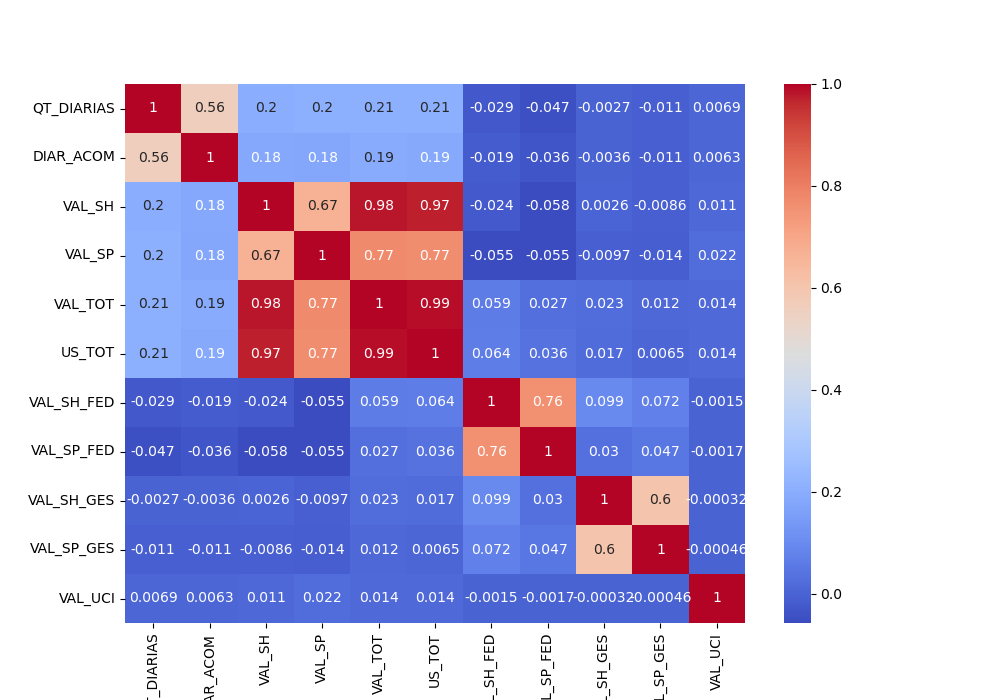
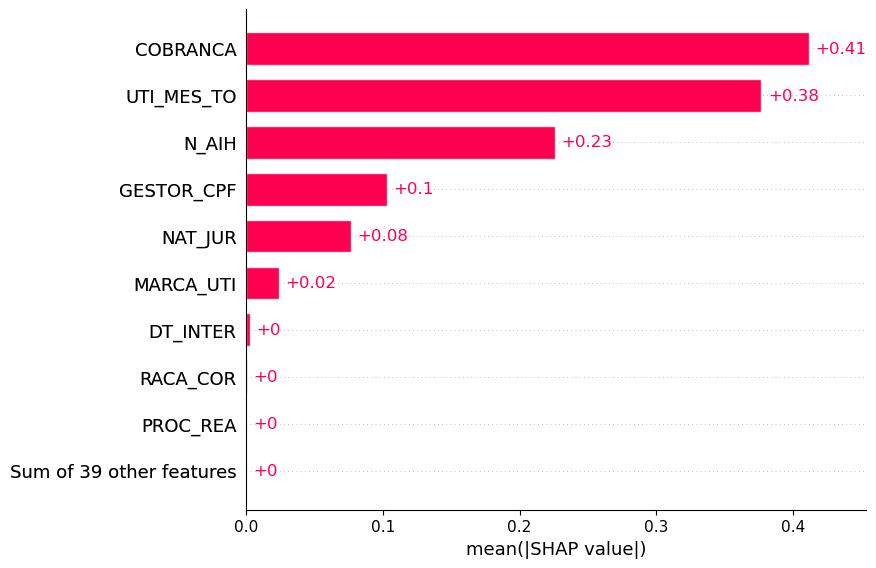
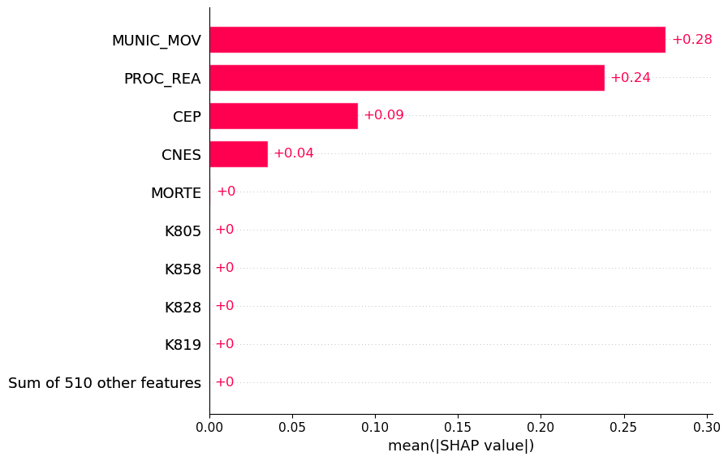
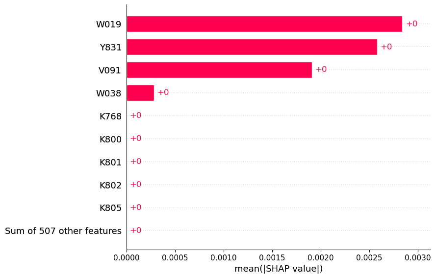
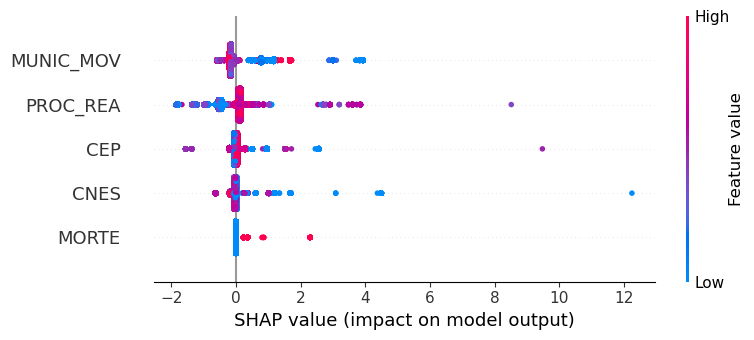
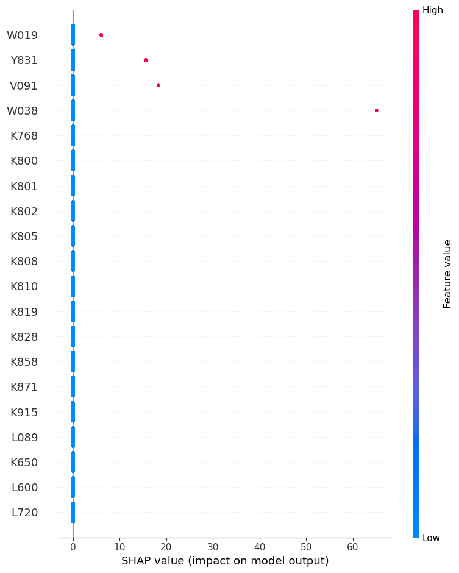
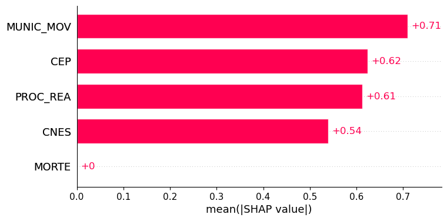
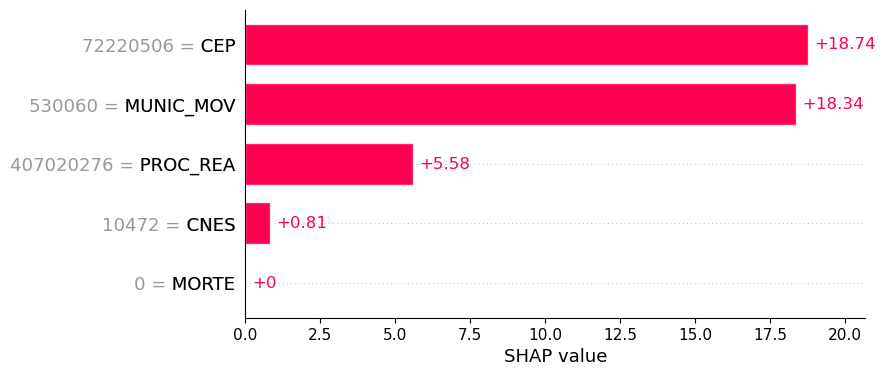
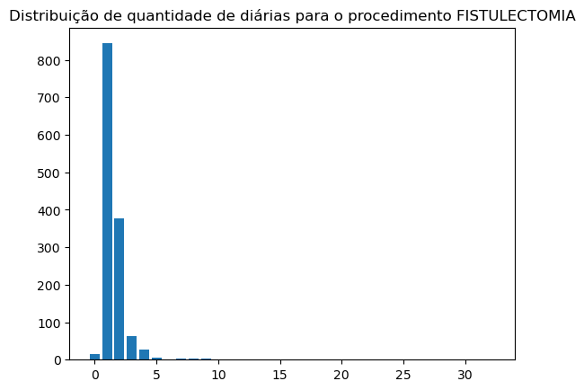
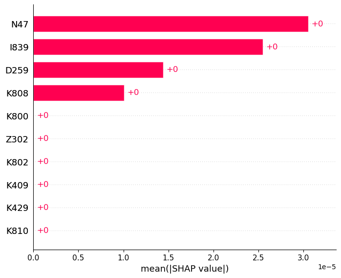

# Dados Medicos

Neste projeto vamos analisar uma base de dados médicos. Para proteger os dados, estes não serão disponibilizados junto com o repositório.

# Passo a Passo

Para a análise dos dados, foi necessário primeiro realizar uma triagem destes. Com uma tabela de 1,2GB e 1048576 linhas, cada uma delas representando um procedimento cirúrgico realizado pelo SUS, a limpeza inicial dos dados foi essencial para realizar qualquer tratamento e análise nestes.

Em mãos de um dicionário de dados, o primeiro tratamento foi remover todas as colunas com valores "Zerados", para reduzir a dimensionalidade dos dados e, com isso, diminuir seu tamanho. As colunas removidas nessa etapa foram:

- UTI_MES_IN
- UTI_MES_AN
- UTI_MES_AL
- UTI_INT_IN
- UTI_INT_AN
- UTI_INT_AL
- VAL_SADT
- VAL_RN
- VAL_ACOMP
- VAL_ORTP
- VAL_SANGUE
- VAL_SADTSR
- VAL_TRANSP
- VAL_OBSANG
- VAL_PED1AC
- DIAG_SECUN
- RUBRICA
- NUM_PROC
- TOT_PT_SP
- CPF_AUT

Depois dessa primeira etapa, uma análise primária dos dados foi realizada com o objetivo de reduzir mais a quantidade de colunas. A partir disso, removeu-se as colunas vazias ou preenchidas com todos os valores identicos, isso porque essa informação não acrescenta valor ao dado analisado, uma vez que todos os registros têm o mesmo preenchimento. Nessa etapa as colunas removidas foram:

|Nome da Coluna|Descrição|Preenchimento|Nota|
|--------------|---------|-------------|----|
|ANO_CMPT | Ano de processamento | todos 2015 | porque a base de dados disponibilizada é a de dados processados em 2015 |
|IDENT | Identificação do tipo da AIH | todos 1 ||
|CAR_INT| Caráter da internação | todos vazios | |
|SEQ_AIH5| Sequencial de longa permanência | todos vazios | |
|GESTOR_DT| Data de autorização do gestor | todos vazios | |
|INFEHOSP| Status de infecção hospitalar | todos 0 | |
|CID_ASSO| CID Causa | todos vazios | dados pessoais |
|CID_MORTE| CID Morte | todos vazios | dados pessoais |
|AUD_JUST| Justificativa do gestor para aceitação | todos vazios | |
|SIS_JUST| Justificativa do estabelecimento para aceitação | todos vazios | |
|DIAGSEC5| Diagnóstico secundário 5 | todos vazios | |
|DIAGSEC6| Diagnóstico secundário 6 | todos vazios | |
|DIAGSEC7| Diagnóstico secundário 7 | todos vazios | |
|DIAGSEC8| Diagnóstico secundário 8 | todos vazios | |
|DIAGSEC9| Diagnóstico secundário 9 | todos vazios | |
|TPDISEC5| Tipo de diagnóstico secundário 5 | todos 0 | |
|TPDISEC6| Tipo de diagnóstico secundário 6 | todos 0 | |
|TPDISEC7| Tipo de diagnóstico secundário 7 | todos 0 | |
|TPDISEC8| Tipo de diagnóstico secundário 8 | todos 0 | |
|TPDISEC9| Tipo de diagnóstico secundário 9 | todos 0 | |

A partir dos dados pré-trabalhados, realizou-se um processo de avaliação da qualidade dos dados em cada um dos atributos do conjunto de dados. Como resultado desse processo, foram removidas as colunas:

| Nome da Coluna | Descrição | Tratamento | Nota |
| -------------- | --------- | ---------- | ---- |
| NASC | Data de nascimento do paciente | Coluna removida | Redundância com coluna Idade. A coluna Idade traz um valor maior para a análise de dados porque não exige tratamento adicional para ser avaliada |
| CEP | CEP do paciente | Coluna removida | Nível de detalhamento irrelevante para a análise |
| MES_CMTP | Mês do processamento | Coluna removida | Identificador irrelevante para a análise ou para identificação |
| NATUREZA | Natureza jurídica do hospital | Coluna removida | Redundância com coluna NAT_JUR e dado desatualizado |
| SEQUENCIA | Sequencial da AIH na remessa | Coluna Removida | Identificação redundante com a coluna N_AIH e irrelevante para a análise |
| REMESSA | Remessa de processamento da AIH | Coluna Removida | Identificação redundante com a coluna N_AIH e irrelevante para a análise |
<!-- | CBOR | Ocupação do paciente de acordo com a Classificação Brasileira de Ocupações | Coluna removida | Identificador irrelevante para a análise ou para identificação | -->
<!-- | DT_SAIDA | Data de saída | Coluna removida | Redundância com a coluna Quantidade de diárias. A coluna Quantidade de diárias traz um valor maior para a análise de dados porque não exige tratamento adicional para ser avaliada | -->

# Definição do Projeto

O objetivo da análise é propor melhorias no sistema de marcação de cirurgias eletivas para redução de filas. O atendimento dos pacientes em cirurgias eletivas é condicionado à quantidade de leitos disponíveis a internação da pessoa na preparação para a cirurgia e cuidados pós-operatórios. Existem duas principais variáveis que impactam na disponibilidade de leitos:

- Dinheiro: para a compra de novos leitos, o que, entretanto, aumenta custos operacionais do sistema de saúde
- Tempo de permanência no hospital: o que impacta na disponibilidade imediata do leito para o paciente futuro

Visando a manutenção do equilíbrio financeiro do sistema único de saúde, a variável resposta da presente análise é a quantidade de diárias (QT_DIARIAS), de forma que, o problema da pesquisa se torna:

_Quais as variáveis de maior impacto na quantidade de diárias que um paciente permanece em um hospital?_

Para responder essa pergunta, algumas considerações iniciais foram realizadas:

- Existem variáveis de alta correlação com a quantidade de diárias (QT_DIARIAS) que um paciente permanece em um hospital, entretanto, essas variáveis são influenciadas pela quantidade de diárias e não o contrário. Portanto, em uma primeira avaliação, foram removidas as variáveis:

| Nome da Coluna | Descrição                      | Motivo da Remoção      | 
| -------------- | ------------------------------ | ---------------------- |
| DIAR_ACOM      | Quantidade de diárias do acompanhante do paciente | Quanto mais diárias um paciente tem em um hospital mais um acompanhante pode ficar no hospital com este, entretanto, sem a existência de um paciente não há acompanhantes e, portanto, não há diárias de acompanhantes |
|VAL_SH| Valor de serviços hospitalares | Os custos da internação de uma pessoa não interferem na quantidade de diárias, mas a quantidade de diárias pode interferir nos custos de uma internação em uma relação diretamente proporcional |
|VAL_SP| Valor de serviços profissionais | Os custos da internação de uma pessoa não interferem na quantidade de diárias, mas a quantidade de diárias pode interferir nos custos de uma internação em uma relação diretamente proporcional |
|VAL_TOT| Valor total | Os custos da internação de uma pessoa não interferem na quantidade de diárias, mas a quantidade de diárias pode interferir nos custos de uma internação em uma relação diretamente proporcional |
|US_TOT| Valor total em dólares | Os custos da internação de uma pessoa não interferem na quantidade de diárias, mas a quantidade de diárias pode interferir nos custos de uma internação em uma relação diretamente proporcional |
|VAL_SH_FED| Valor do complemento federal de serviços hospitalares | Os custos da internação de uma pessoa não interferem na quantidade de diárias, mas a quantidade de diárias pode interferir nos custos de uma internação em uma relação diretamente proporcional |
|VAL_SP_FED| Valor do complemento federal de serviços profissionais | Os custos da internação de uma pessoa não interferem na quantidade de diárias, mas a quantidade de diárias pode interferir nos custos de uma internação em uma relação diretamente proporcional |
|VAL_SH_GES| Valor do complemento do gestor de serviços hospitalares | Os custos da internação de uma pessoa não interferem na quantidade de diárias, mas a quantidade de diárias pode interferir nos custos de uma internação em uma relação diretamente proporcional |
|VAL_SP_GES| Valor do complemento do gestor de serviços profissionais | Os custos da internação de uma pessoa não interferem na quantidade de diárias, mas a quantidade de diárias pode interferir nos custos de uma internação em uma relação diretamente proporcional |
|VAL_UCI| Valor de UCI | Os custos da internação de uma pessoa não interferem na quantidade de diárias, mas a quantidade de diárias pode interferir nos custos de uma internação em uma relação diretamente proporcional |

A correlação entre cada uma das variáveis em relação à quantidade de dias (QT_DIARIAS) de internação do paciente pode ser observada na [Figura 1](#Figura_1)

[Figura_1]: imagens/correlation_matrix_removal.png "Matriz de correlação entre as colunas removidas e a quantidade de diárias do paciente" 

A [Figura 1](#Figura_1) indica uma alta correlação entre a quantidade de diárias do paciente e a quantidade de diárias do acompanhante e uma baixa correlação entre a quantidade de diárias do paciente e os custos associados à estadia deste. Não descarta-se, entretanto, uma possível relação entre a quantidade de diárias e os custos de internação, só indica-se que outros fatores, como o procedimento realizado, podem ter mais relação com os custos.

Após essas análises, foi executado um modelo de predição para avaliar a possibilidade de prever o comportamento da quantidade de diárias com as variáveis do prontuário do paciente, entretanto, algumas das variáveis mais importantes não têm uma relação de causalidade com a quantidade de diárias ou são variáveis identificadoras com números arbitrários para a avaliação.

[Figura_2]: imagens/shap_ruim.png "Importância entre as variáveis não muito adequadas e a quantidade de diárias do paciente" 

A váriavel que, de acordo com o diagrama da [Figura 2](#Figura_2) mais impactaria na quantidade de diárias é o motivo da saída da pessoa do hospital, entretanto, essa variável é obtida a posteriori da saída e, portanto, não pode ser utilizada como predição. Outra variável irrelevante é o número do prontuário, um identificador aleatório e único para registrar o prontuário no sistema, variável que não representa relação qualquer de causalidade com a quantidade de diárias do paciente.

Em conversas com representantes do ministério da saúde, entretanto, foram levantadas as variáveis com maior importância de negócio para a apreciação do problema de filas. Essas variáveis são:

| Nome da Coluna | Descrição                      | 
| -------------- | ------------------------------ |
|CEP| CEP de residência do paciente |
|MUNIC_MOV| Município do hospital |
|PROC_REA| Procedimento realizado |
|DIAG_PRINC| Diagnóstico principal |
|DIAGSEC1| Diagnóstico secundário 1 |
|DIAGSEC2| Diagnóstico secundário 2 |
|DIAGSEC3| Diagnóstico secundário 3 |
|DIAGSEC4| Diagnóstico secundário 4 |
|MORTE| Se houve óbito na cirurgia |
|CNES| CNES do hospital	|
|QT_DIARIAS| Quantidade de diárias do paciente |
|VAL_TOT| Valor total investido no paciente |

Como discutido previamente, o Valor Total não constitui uma relação de causalidade com a quantidade de diárias (apesar da quantidade de diárias consituir uma relação de causalidade com o valor total), dessa forma, para a análise de quantidade de diárias, esta variável foi descartada, entretanto, para a avaliação do valor total a variável quantidade de diárias é considerada uma variável preditora.

A parte mais importante da realização do projeto é o entendimento das variáveis analisadas. Neste caso, diagnóstico, separado em 5 categorias, é uma variável peculiar participante da análise. para este caso, a categoria do diagnóstico, isso é, se o diagnóstico é principal, secundário 1, 2, 3 ou 4 não importa para a análise, o ponto importante é definir se o paciente tem ou não determinado diagnóstico em algum momento. Além disso, esta variável é textual e não pode ser diretamente convertida em números já que cada letra presente no valor do diagnóstico representa uma categoria diferente. Nesse caso, um processo de engenharia de atributo foi realizado, primeiro houve a tokenização, neste caso a indicação se em cada coluna existia determinado diagnóstico e, em uma segunda etapa, a junção dos diagnósticos de todas as colunas, criando, assim, uma coluna para cada possível diagnóstico indicando se determinado paciente recebeu ou não este diagnóstico não importando se este foi principal ou secundário.

Essa junção foi importante para reduzir a dimensionalidade dos dados após a tokenização destes atributos e possibilitar a execução do projeto.

Após isso, foi aplicado um modelo de Árvore de Decisão para a avaliação dos dados. Este modelo foi escolhido por sua flexibilidade em termos de tipos e escalas de dados de entrada para a realização de uma classificação ou, neste caso, regressão. 

Os resultados deste modelo foram avaliados levando em consideração a importância de cada uma das variáveis na composição dos resultados. Para uma avaliação mais robusta, foi necessário separar os diagnósticos das demais variáveis, uma vez que estes não consistiram um valor de importância próximo o suficiente das demais variáveis para serem considerados no cálculo de Shapley-Values.

Esse "irrelevância" aparente se dá pela variedade de diagnósticos. Com a possibilidade de 514 diagnósticos diferentes, a distribuição se torna esparsa e, com isso, dificulta a avaliação da importancia dos diagnósticos para a definição da quantidade de dias que o paciente ficará internado. Para uma avaliação mais precisa, primeiro avaliou-se as demais variáveis [Figura 3](#Figura_3). 

[Figura_3]: imagens/shap_variaveis.png "Importância entre as variáveis e a quantidade de diárias do paciente" 

E, em seguida, fizemos uma avaliação dos diagnósticos [Figura 4](#Figura_4).

[Figura_4]: imagens/shap_diagnosticos.png "Importância entre os diagnósticos e a quantidade de diárias do paciente" 

Por essa análise, foi possível avaliar que existem municípios com diárias de internações expressivamente maiores que outros, podendo indicar uma qualidade discrepante no atendimento entre diferentes municípios, uma superlotação maior ou um preparo maior da equipe do hospital, entretanto, a avaliação qualitativa desse resultado não é escopo atual deste projeto. Outra avaliação possível, que faz sentido com o significado das variáveis é que o procedimento realizado impacta diretamente na quantidade de diárias, isto é um indicativo da diferença de complexidades e tempos de pós-operatório de diferentes procedimentos cirúrgicos ou da maior taxa de complicações em diferentes procedimentos. 

Além disso, pôde-se avaliar que o óbito não é um fator determinante para a quantidade de diárias dos pacientes, apesar de valores individuais terem um impacto relevante na avaliação [Figura 5](#Figura_5), levando a avaliar que, em um contexto geral, o óbito não impacta na avaliação, mas que, para pacientes específicos impacta diretamente na quantidade de diárias, com a redução prematura das diárias devido o óbito do paciente.

[Figura_5]: imagens/ind_contribution_variaveis.png "Importância individual entre as variáveis e a quantidade de diárias do paciente" 

Em relação aos diagnósticos 4 se destacaram na importância para determinação da quantidade de diárias [Figura 4](#Figura_4), com alto impacto em valores individuais também [Figura 6](#Figura_6). Foram eles: 

| CID10 | Descrição                      | 
| -------------- | ------------------------------ |
| W019 |  Queda no mesmo nível por escorregão, tropeção ou passos em falsos em local não especificado |
| Y831 |  Reação anormal em paciente ou complicação tardia, causadas por intervenção cirúrgica com implante de uma prótese interna, sem menção de acidente durante a intervenção |
| V091 |  Pedestre traumatizado em um acidente não-de-trânsito não especificado |
| W038 |  quedas no mesmo nível causadas por colisões ou empurrões de terceiros, em locais específicos não listados de forma detalhada |

[Figura_6]: imagens/ind_contribution_diagnosticos.png "Importância individual entre os diagnósticos e a quantidade de diárias do paciente" 

# Avaliação de um modelo de predição

Durante os testes dos modelos de predição, foi determinado que o algoritmo de árvore de decisão não atingiu uma performance interessante para a escolha deste como modelo de previsão de quantidade de diárias em hospitais, dessa forma, a relação das próximas etapas previstas contou também com a avaliação do Gaussian Naive Bayes como método de previsão de quantidade de diárias de um paciente de cirurgia eletiva em um hospital.

Nesse caso, entende-se que o problema, em realidade, se trata de uma classificação, uma vez que, nos dados analisados, a quantidade de dias não é contínua, e sim, um problema de classificação múltipla. 

A escolha de um modelo mais apropriado e uma avaliação melhor do tipo de problema foi realizada após a avaliação do coeficiente de determinação e sua comparação entre as performances, no mesmo dataset de treino e teste, dos algoritmos:

| Algoritmo | Score |
| Árvore de Decisão | 0.03 |
| KNN | 0.05 |
| Naive Bayes | 0.6 |
| SVM | 0.1 |

A partir destes resultados de coeficiente de determinação, foi escolhido o algoritmo de Naive Bayes para prosseguir com o experimento realizado em um primeiro momento, que, por definição, é um modelo de classificação.

# Revalidação do coeficiente de importância para as variáveis do dataset

Com a escolha de um novo modelo, foi necessária a reavaliação das importâncias do modelo.

Para as variáveis gerais, a importância se manteve entre as variáveis, indicando que pode existir uma ocorrência maior de internações mais longas ou mais curtas a depender do múnicípio de residência do paciente, do local de seu atendimento e do procedimento realizado [Figura 7](#Figura_7).

[Figura_7]: imagens/shap_variaveis_NB.png "Importância entre as variáveis e a quantidade de diárias do paciente" 

Adicionalmente, para cada uma dessas variáveis foram análisados os valores que mais impactam na quantidade de diárias [Figura 8](#Figura_8).

[Figura_8]: imagens/ind_contribution_variaveis_NB_valores_mais_importantes.png "Importância específica entre as variáveis e a quantidade de diárias do paciente" 

A partir desta avaliação, é possível extrair que o procedimento de código 407020276 (FISTULECTOMIA) tem um maior impacto na quantidade de diárias que demais procedimentos. Esse impacto se dá na simplicidade do procedimento que gera diárias menores entre 0 e 5 dias [Figura 9](#Figura_9).

[Figura_9]: imagens/distribuicao_fistulectomia.png "Distribuição de quantidade de diárias para o procedimento FISTULECTOMIA" 

Existe, entretanto, um caso no qual o paciente ficou 32 dias internado devido a realização deste [Figura 9](#Figura_9), analisando os dados disponíveis não foi encontrado nenhum motivo para a ocorrência desta anormalidade, indicando que algo pode ter acontecido com o paciente que não consta no relatório médico ou o esquecimento de realizar o procedimento de alta ao paciente.

Em relação aos diagnósticos, foi necessário realizar uma divisão entre diagnóstico principal e diagnósticos secundários pela alta complexidade computacional de processar o grau de importância de variáveis para o algoritmo de Naive Bayes. 

Antes de realizar essa avaliação, buscou-se o entendimento dos diagnósticos préviamente identificados com a maior importância para buscar elucidar os padrões existentes entre estes e a quantidade de diárias do paciente. Após essa avaliação, foi identificado que a ocorrência de todos os diagnósticos entendidos como mais importantes, acontecem como diagnósticos secundários como qualificadores, ou seja, grupos, de diagnósticos principais e, com isso, esses diagnósticos sozinhos não indicam uma relação forte de causalidade com o tempo de internação do paciente.

Um exemplo dessa análise foi a apreciação de quais diagnósticos principais corresponderiam aos diagnósticos secundários mais importantes, entre eles o diagnóstico S720 de fratura no colo do fêmur com uma mediana de 7 diárias no hospital, 7 vezes maior do que a mediana geral de uma diária e média de 10 dias, 5 vezes maior que a média geral de diárias no hospital. 

Outra análise foi a avaliação do diagnístico W038 o qual tem apenas uma ocorrência na base de dados avaliada e corresponde à causa do diagnóstico S730 de Luxacao da articulacao do quadril. Avaliando apenas o diagnóstico S730, são encontradas tendências indicadoras de complexidade semelhantes à análise do diagnóstico S720, entretanto, neste caso específico associado à causa W038 (quedas no mesmo nível causadas por colisões ou empurrões de terceiros, em locais específicos não listados de forma detalhada) o paciente permaneceu internado por 67 dias, entretanto, não é possível estabelecer uma relação de causalidade forte entre o empurrão e a quantidade de diárias, uma vez que, a causa da necessidade da cirurgia foi a luxação do quadril e não o empurrão. 

As avaliações de acidente de transito (V019) e Reação anormal em paciente ou complicação tardia, causadas por intervenção cirúrgica (Y831) também foram avaliadas e a relação encontrada entre essas situações e os diagnósticos principais indicam a prevalência geral de diagnósticos mais complexos, além disso, essas situações são tratadas com maior rigor no meio médico e, portanto, não serão excluídos da análise.

A implementação da avaliação de importância por meio de SHAP Values para o algoritmo de Naive Bayes é computacionalmente complexa, portanto, escolheu-se realizar a análise para os 10 diagnósticos mais comuns que representam 40% da ocorrência total de cirurgias disponíveis para a análise.

Mesmo com este recorte, os dados analisados demonstram uma importância baixa para todos os diagnósticos identificados [Figura 10](#Figura_10).

[Figura_10]: imagens/shap_diagnosticos_mais_comuns.png "Análise de importância dos diagnósticos mais comuns" 

Os diagnósticos encontrados são:

| CID10 | Descrição                      | 
| -------------- | ------------------------------ |
| N47 |  Hipertrofia do prepúcio, fimose e parafimose |
| I839 |  Varizes dos membros inferiores sem úlcera ou inflamação |
| D259 |  Leiomioma do útero, não especificado |
| K808 |  Cálculos biliares que não se encaixam nas categorias mais específicas de colelitíase |

Como resultados de todas essas avaliações identificou-se que a grande dispersão dos dados reduz qualquer validação de importância dos diagnósticos na permanência do paciente no hospital.

# Próximas etapas

Para avaliações mais robustas e mais completas, as próximas etapas são:

- Avaliação e limpeza dos dados
- Avaliação de outros modelos preditivos
- Avaliação de variáveis estatisticamente relevantes
- Replicação das análises para o valor total como variável resposta
- Replicação das análises para o óbito como variável resposta
